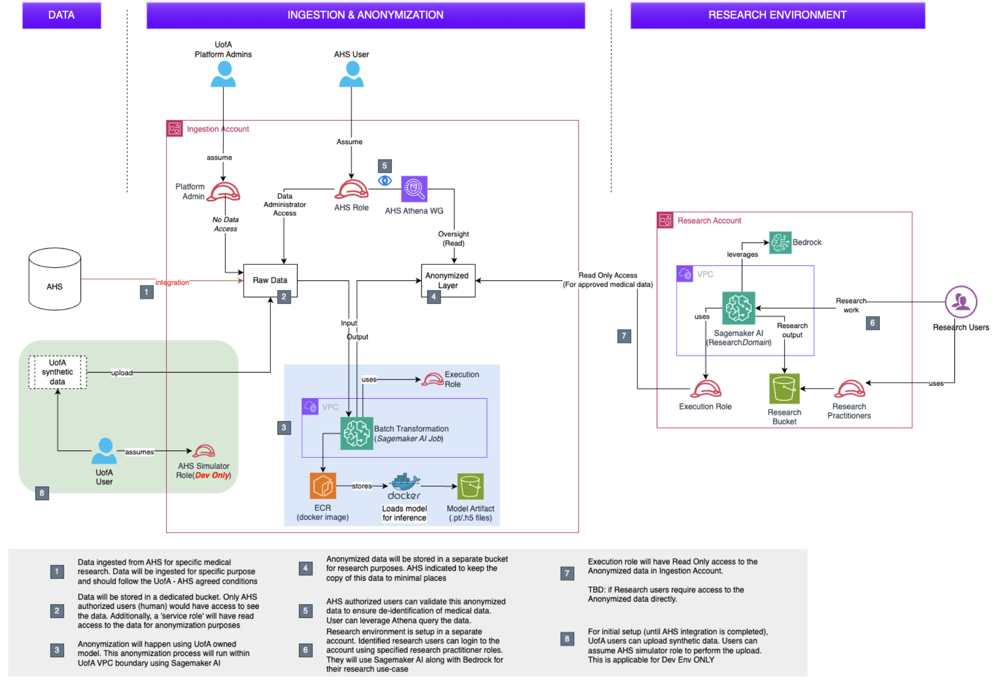

# University of Alberta AWS Trusted Research Environment (TRE) Architecture Assessment

> **Note:** This document is provided as a Markdown file for reuse, version control, and further editing.  
> The architecture diagram should be stored in the same directory and referenced as:
> `aws_tre_diagram.png`

---

## Overview and Alignment with Alberta Health Information Act (HIA)

The University of Alberta’s Trusted Research Environment (TRE) is designed as a secure, cloud-based analytics environment to enable advanced health research while complying with Alberta’s **Health Information Act (HIA)**. The TRE follows a **three-zone architecture** (identifiable / controlled processing / research) consistent with modern safe-haven and Trusted Research Environment models.

The architecture ensures:
- Identifiable health data remain under custodian control
- De-identification and linkage occur in controlled zones
- Researchers access only de-identified or approved data
- All analysis occurs within a monitored environment
- Outputs are subject to airlock-style review

This design aligns with HIA principles of data minimization, proportionality, auditability, and controlled disclosure.

### Architecture Diagram

---

## Core and Emerging Use Cases

### 1. Translational Multi-Omics Research
The TRE clarifies a critical institutional need: linking **clinical phenotypes** with **genomics, proteomics, metabolomics, and glycomics** data in a single secure environment. The architecture supports:
- Large-scale storage (e.g., S3-backed data lake)
- Scalable compute (cloud + on‑prem GPU)
- Secure linkage across data modalities

This mirrors leading translational pipelines globally.

### 2. Biobank and Biosample Linkage
Physical biosamples remain on University premises, while metadata and clinical context are stored in Snowflake or equivalent custodian systems. The TRE:
- Links biosample identifiers to de-identified clinical data
- Supports consent-based access workflows
- Enables cross-study reuse without data duplication

### 3. Clinical Trial Feasibility and Recruitment
The architecture supports **near–real-time cohort discovery**:
- Batch and incremental feeds from clinical systems
- OMOP-based cohort definitions
- Aggregate counts and feasibility analytics
- Separation of recruitment actions from research access

### 4. Federated Analytics (VITAL / OMOP)
The TRE can act as Alberta’s node in federated networks such as **VITAL**:
- Local execution of standardized queries
- Sharing of aggregate results only
- Alignment with GEMINI / OMOP approaches
- Reduced need for central data pooling

---

## Comparison With International Biobank Models

### UK Biobank
UK Biobank operates a mandatory cloud-based Research Analysis Platform (RAP):
- Researchers access data only within a secure environment
- Clinical data are regularly linked from NHS systems
- Direct identifiers are never released
- Governance via a formal Access Committee

**Key parallel:** Alberta’s TRE follows the same “bring researchers to the data” model.

**Key difference:** UK Biobank is international and fully centralized; Alberta’s TRE is regionally governed with custodian partnership.

### All of Us (USA)
All of Us uses a cloud-based Researcher Workbench:
- Tiered access model
- OMOP common data model
- Mandatory researcher training
- Integrated cohort builder tools

**Key lesson:** Strong user enablement + governance scales adoption.

### FinnGen (Finland)
FinnGen uses a nationally certified secure sandbox:
- Nationwide registry linkage
- Genomics + longitudinal health data
- No raw data export
- Formal regulatory certification

**Key lesson:** TRE certification and long-term investment enable trust at national scale.

### Genomics England
Genomics England provides a secure research environment linking:
- Whole genome sequencing
- NHS clinical records
- Strict access review
- Airlock-based output controls

**Key parallel:** Strong similarity to Alberta’s hybrid custodian–academic model.

---

## Snowflake Native Apps vs AWS TRE

| Dimension | Snowflake Native Apps | AWS TRE |
|--------|----------------------|---------|
| Primary role | Data sharing & SQL analytics | Full research compute |
| Compute | SQL / limited Python | Arbitrary compute, GPUs |
| Data types | Structured | Structured + unstructured |
| Governance | Platform-enforced | Custom, policy-driven |
| Federation | Strong | Emerging |
| Best use | Standardized analytics | Discovery, AI, pipelines |

**Conclusion:** Snowflake complements but does not replace a TRE.

---

## Strengths of the UAlberta TRE

- Strong alignment with HIA and custodian expectations
- Supports advanced analytics beyond warehouse-native tools
- Enables hybrid cloud + on-prem GPU strategy
- Scales to future federated and AI-driven use cases
- Positions Alberta as a national leader

---

## Key Gaps to Address

- Formalized access and governance committees
- Project-level isolation and cost attribution
- Real-time / streaming data patterns
- Metadata catalog and dataset discoverability
- Long-term sustainability funding model

---

## Recommendations

### Technical
- Project-based isolated workspaces
- Automated de-identification pipelines
- OMOP-native tooling (OHDSI / ATLAS)
- Metadata catalog integration
- Hybrid compute orchestration

### Governance
- Formal Data Access Committee
- Mandatory researcher training
- Standard operating procedures
- External audit / certification pathway

### Cost & Sustainability
- Per-project cost tracking
- Budget alerts and quotas
- Institutional base funding + chargeback
- Continuous cost optimization

---

## Final Assessment

The AWS-based TRE remains **highly viable and strategically differentiated**, even after de-identification is repositioned per the Three-Zone Architecture. Its value lies not in replacing Snowflake, but in enabling **integration, discovery, and translational research workflows** that require flexibility, scale, and hybrid compute.

With modest governance and platform investments, the University of Alberta TRE can match global best practices set by UK Biobank, All of Us, and FinnGen—while remaining uniquely suited to Alberta’s legal, institutional, and research context.
